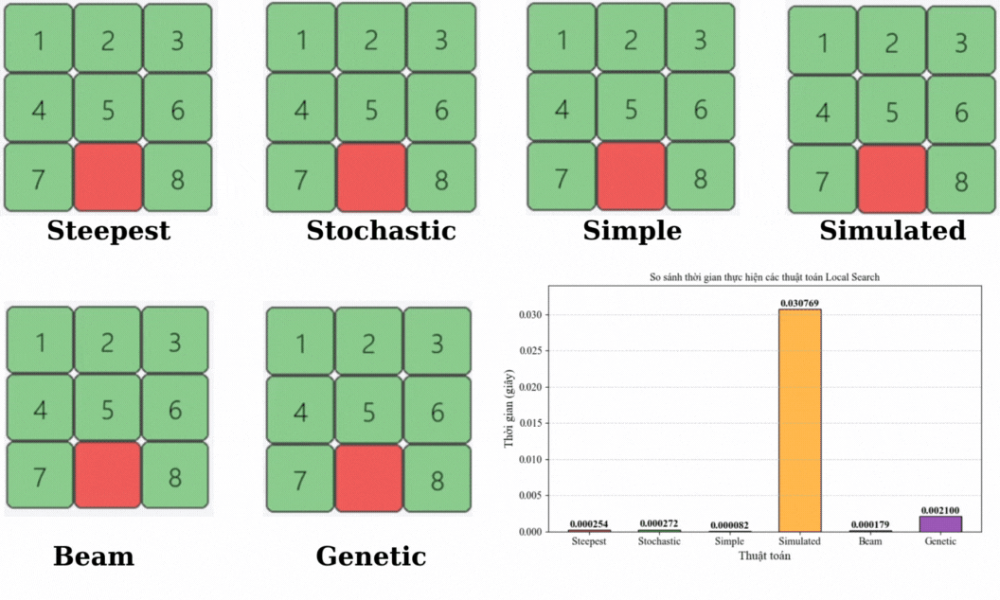

# Bài tập Cá nhân AI
## Đặng Xuân Huyền - 23110232
### 1. Mục tiêu: 
Trong đồ án cá nhân, các nhóm thuật toán tìm kiếm trong Trí tuệ nhân tạo được nghiên cứu và áp dụng nhằm giải quyết bài toán 8-puzzle – một bài toán cổ điển thể hiện rõ đặc trưng của việc tìm kiếm lời giải trong không gian trạng thái. Cụ thể, đề tài tập trung vào 6 nhóm thuật toán chính: 
- Thuật toán tìm kiếm không có thông tin (Uninformed Search) như BFS, DFS, IDS và UCS, giúp khảo sát khả năng tìm lời giải khi không có thông tin định hướng; 
- Thuật toán tìm kiếm có thông tin (Informed Search) như A*, IDA* và Greedy Best-First Search, sử dụng heuristic để tối ưu hóa hiệu quả tìm kiếm; 
- Tìm kiếm cục bộ (Local Search) như Hill Climbing, Steepest Ascent Hill Climbing, Simple Hill Climbing Simulated Annealing, Stochastic Hill Climbing và Beam Search tập trung vào việc cải thiện nghiệm cục bộ mà không cần duy trì toàn bộ không gian trạng thái; 
- Tìm kiếm trong môi trường phức tạp (Searching in Complex Environments) như AND-OR Graph Search, Searching for a partially observation, Sensorless mở rộng khả năng ứng dụng sang các bài toán có tính động và không chắc chắn, định hướng cho các nghiên cứu nâng cao; 
- Bài toán thỏa mãn ràng buộc (Constraint Satisfaction Problems - CSP) nhằm khảo sát khả năng biểu diễn 8-puzzle dưới dạng hệ thống ràng buộc logic; 
- Cuối cùng là học tăng cường (Reinforcement Learning), cụ thể là thuật toán Q-learning, cho phép tác nhân học cách giải quyết bài toán thông qua việc tương tác với môi trường. 
Việc triển khai và so sánh các nhóm thuật toán này không chỉ giúp đánh giá hiệu quả của từng phương pháp mà còn mở ra các hướng tiếp cận đa dạng, góp phần làm phong phú thêm ứng dụng của Trí tuệ nhân tạo trong giải quyết các bài toán tìm kiếm.
### 2. Nội dung
#### *2.1. Uninformed Search Algorithms*

### 2. Informed Search Algorithms

### 3. Local Search
