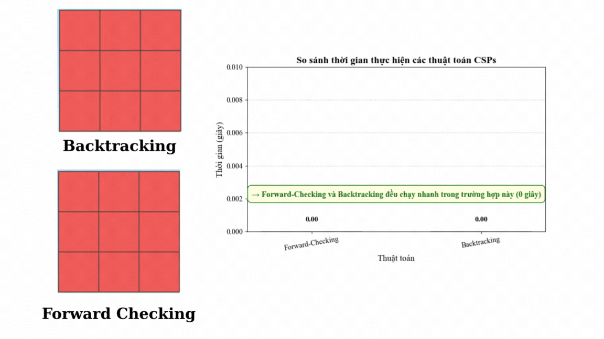
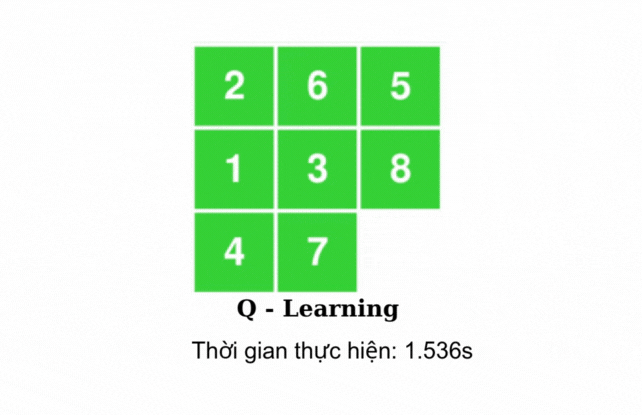

# Bài tập Cá nhân AI
## Đặng Xuân Huyền - 23110232
### 1. Mục tiêu: 
Trong đồ án cá nhân, các nhóm thuật toán tìm kiếm trong Trí tuệ nhân tạo được nghiên cứu và áp dụng nhằm giải quyết bài toán 8-puzzle – một bài toán cổ điển thể hiện rõ đặc trưng của việc tìm kiếm lời giải trong không gian trạng thái. Cụ thể, đề tài tập trung vào 6 nhóm thuật toán chính: 
- Thuật toán tìm kiếm không có thông tin (Uninformed Search) như BFS, DFS, IDS và UCS, giúp khảo sát khả năng tìm lời giải khi không có thông tin định hướng; 
- Thuật toán tìm kiếm có thông tin (Informed Search) như A*, IDA* và Greedy Best-First Search, sử dụng heuristic để tối ưu hóa hiệu quả tìm kiếm; 
- Tìm kiếm cục bộ (Local Search) như Hill Climbing, Steepest Ascent Hill Climbing, Simple Hill Climbing Simulated Annealing, Stochastic Hill Climbing và Beam Search tập trung vào việc cải thiện nghiệm cục bộ mà không cần duy trì toàn bộ không gian trạng thái; 
- Tìm kiếm trong môi trường phức tạp (Searching in Complex Environments) như AND-OR Graph Search, Searching for a partially observation, Sensorless mở rộng khả năng ứng dụng sang các bài toán có tính động và không chắc chắn, định hướng cho các nghiên cứu nâng cao; 
- Bài toán thỏa mãn ràng buộc (Constraint Satisfaction Problems - CSP) như Min-conflicts search, Forward-Checking, Backtracking nhằm khảo sát khả năng biểu diễn 8-puzzle dưới dạng hệ thống ràng buộc logic; 
- Cuối cùng là học tăng cường (Reinforcement Learning), cụ thể là thuật toán Q-learning, cho phép tác nhân học cách giải quyết bài toán thông qua việc tương tác với môi trường.
Việc triển khai và so sánh các nhóm thuật toán này không chỉ giúp đánh giá hiệu quả của từng phương pháp mà còn mở ra các hướng tiếp cận đa dạng, góp phần làm phong phú thêm ứng dụng của Trí tuệ nhân tạo trong giải quyết các bài toán tìm kiếm.
### 2. Nội dung
#### *2.1. Uninformed Search Algorithms*
Một bài toán tìm kiếm trong trí tuệ nhân tạo thường bao gồm các thành phần chính sau:
- Không gian trạng thái (State space): Tập hợp tất cả các trạng thái có thể có của bài toán.
- Trạng thái khởi đầu (Initial state): Trạng thái bắt đầu của bài toán.
- Trạng thái đích (Goal state): Trạng thái hoặc tập các trạng thái mà ta muốn tìm đến.
- Hàm chuyển đổi (Transition function): Các phép biến đổi từ trạng thái này sang trạng thái khác.
- Hàm kiểm tra trạng thái đích (Goal test): Kiểm tra xem trạng thái hiện tại có phải là trạng thái đích không.
- Chi phí (Cost function): Chi phí để đi từ trạng thái này sang trạng thái khác (nếu có).

Solution (giải pháp) là một chuỗi các hành động hoặc trạng thái từ trạng thái khởi đầu đến trạng thái đích thỏa mãn bài toán tìm kiếm. Nó là kết quả cuối cùng mà thuật toán tìm kiếm trả về khi tìm được đường đi hoặc phương án thỏa mãn điều kiện mục tiêu

#### *Nhận xét:*
- DFS (Depth-First Search): Duyệt sâu vào nhánh trước, tốn ít bộ nhớ nhưng dễ rơi vào vòng lặp vô hạn và không đảm bảo tìm giải pháp tối ưu; không phù hợp cho không gian trạng thái lớn như 8-puzzle.
- BFS (Breadth-First Search): Đảm bảo tìm được giải pháp ngắn nhất nhưng tốn rất nhiều bộ nhớ và thời gian khi không gian trạng thái lớn, dễ bị bùng nổ tổ hợp trong 8-puzzle.
- UCS (Uniform-Cost Search): Tương tự BFS nhưng xét chi phí đường đi, đảm bảo tìm giải pháp tối ưu theo chi phí, tuy nhiên cũng rất tốn bộ nhớ và thời gian trong bài toán 8-puzzle.
- IDS (Iterative Deepening Search): Kết hợp ưu điểm của DFS và BFS, tiết kiệm bộ nhớ hơn BFS, tránh vòng lặp của DFS, nhưng thường chậm hơn do phải lặp lại tìm kiếm nhiều lần; vẫn chưa hiệu quả bằng các thuật toán heuristic trong 8-puzzle.
*Tóm lại,* các thuật toán không thông tin này đều có hạn chế về hiệu suất khi áp dụng cho bài toán 8-puzzle do không sử dụng thông tin hướng dẫn, dẫn đến tốn nhiều thời gian và bộ nhớ
#### *2.2. Informed Search Algorithms*
Một bài toán tìm kiếm thường bao gồm các thành phần cơ bản sau:
- Trạng thái ban đầu (Initial state): Trạng thái xuất phát của bài toán.
- Trạng thái đích (Goal state): Trạng thái hoặc tập trạng thái mà ta cần tìm đến.
- Hành động (Actions): Các phép biến đổi để chuyển từ trạng thái này sang trạng thái khác.
- Hàm chi phí (Cost function): Chi phí thực hiện mỗi hành động hoặc di chuyển giữa các trạng thái.
- Hàm kiểm tra trạng thái đích (Goal test): Kiểm tra xem trạng thái hiện tại có phải là trạng thái đích không.
Solution (giải pháp) là chuỗi các hành động hoặc trạng thái từ trạng thái ban đầu đến trạng thái đích, thỏa mãn yêu cầu của bài toán tìm kiếm.

#### *Nhận xét:*
- Thuật toán A* là lựa chọn hàng đầu cho bài toán 8-puzzle nhờ khả năng tìm lời giải tối ưu với hiệu suất tốt khi sử dụng hàm heuristic phù hợp.
- Greedy Best-First Search nhanh nhưng không tối ưu, dễ mắc sai lầm trong không gian trạng thái phức tạp.
- IDA* là giải pháp thay thế cho A* khi bộ nhớ hạn chế, vẫn đảm bảo tính tối ưu nhưng đổi lại thời gian chạy có thể lâu hơn.
*Tóm lại,* Các thuật toán tìm kiếm có sử dụng thông tin (heuristic) giúp giảm đáng kể số trạng thái cần duyệt so với các thuật toán tìm kiếm không thông tin, đặc biệt trong các bài toán phức tạp như trò chơi 8-puzzle
#### *2.3. Local Search* 
Các thành phần chính của bài toán tìm kiếm
- Trạng thái ban đầu (Initial state): Điểm xuất phát của bài toán.
- Trạng thái đích (Goal state): Mục tiêu cần đạt được.
- Hành động (Actions): Các phép biến đổi để di chuyển giữa các trạng thái.
- Hàm chi phí (Cost function): Chi phí thực hiện hành động hoặc di chuyển.
- Hàm đánh giá (Heuristic function): Ước lượng mức độ gần trạng thái hiện tại đến trạng thái đích (đặc biệt trong tìm kiếm có thông tin).
Solution (Giải pháp): Chuỗi các hành động hoặc trạng thái từ trạng thái ban đầu đến trạng thái đích thỏa mãn yêu cầu bài toán.

#### *Nhận xét:*
- Các thuật toán Hill Climbing đơn giản nhanh nhưng dễ bị kẹt tại cực trị địa phương, không đảm bảo tìm lời giải tối ưu trong 8-puzzle.
- Simulated Annealing cải thiện khả năng thoát khỏi cực trị địa phương, phù hợp với bài toán 8-puzzle phức tạp.
- Beam Search giúp cân bằng giữa bộ nhớ và thời gian, hiệu quả nếu chọn beam width phù hợp.
- Genetic Algorithm có thể tìm lời giải tốt trong không gian trạng thái lớn nhưng cần nhiều tính toán và tinh chỉnh tham số.
*Tóm lại,* Tìm kiếm cục bộ và tiến hóa cung cấp các phương pháp linh hoạt, có thể áp dụng trong 8-puzzle để tìm lời giải gần tối ưu nhanh hơn so với tìm kiếm toàn diện, nhưng không đảm bảo tối ưu tuyệt đối.
#### *2.4. Searching in Complex Environments*
Một bài toán tìm kiếm trong môi trường phức tạp thường bao gồm các thành phần sau:
- Không gian trạng thái (State space): Tập hợp tất cả các trạng thái có thể xảy ra trong môi trường, mô tả các cấu hình hoặc vị trí khác nhau của hệ thống.
- Trạng thái ban đầu (Initial state): Trạng thái xuất phát, nơi quá trình tìm kiếm bắt đầu.
- Trạng thái đích hoặc mục tiêu (Goal state): Trạng thái hoặc tập hợp trạng thái mà ta muốn đạt tới.
- Toán tử chuyển trạng thái (Actions/Operators): Các phép biến đổi cho phép chuyển từ trạng thái này sang trạng thái khác trong không gian trạng thái.
- Hàm kiểm tra trạng thái đích (Goal test): Hàm xác định xem trạng thái hiện tại có phải là trạng thái mục tiêu hay không.
- Thông tin quan sát (Observability): Trong môi trường phức tạp, có thể trạng thái không được quan sát đầy đủ hoặc chỉ quan sát một phần, dẫn đến các bài toán tìm kiếm một phần quan sát (partially observable).
- Mô hình môi trường (Model of environment): Mô tả cách trạng thái chuyển đổi dựa trên hành động, có thể là xác định hoặc ngẫu nhiên.
Solution là một chuỗi các hành động hoặc kế hoạch (plan) từ trạng thái ban đầu đến trạng thái mục tiêu, sao cho thỏa mãn các ràng buộc của môi trường và đạt được mục tiêu đề ra.

#### *Nhận xét:*
Các thuật toán tìm kiếm trong môi trường phức tạp như AND-OR, Sensorless, và tìm kiếm trong môi trường quan sát một phần đều phải đối mặt với độ phức tạp rất lớn khi áp dụng cho bài toán 8-puzzle do không gian trạng thái rộng và các hạn chế trong quan sát. Vì vậy, hiệu suất của chúng thường kém và khó áp dụng trực tiếp cho 8-puzzle kích thước đầy đủ mà không có các kỹ thuật tối ưu hóa hoặc giảm không gian trạng thái.
#### *2.5. Constraint Satisfaction Problems* 
Các thành phần cơ bản của một bài toán CSP bao gồm:
- Tập biến (Variables): Tập hợp các biến cần gán giá trị (ví dụ: X1, X2, ..., Xn).
- Miền giá trị (Domains): Mỗi biến có một miền giá trị khả dĩ (ví dụ: D1, D2, ..., Dn), là các giá trị mà biến đó có thể nhận.
- Tập ràng buộc (Constraints): Các điều kiện hoặc quan hệ giữa các biến, xác định các tổ hợp giá trị hợp lệ giữa một hoặc nhiều biến.
- Hàm kiểm tra ràng buộc (Constraint Checking): Hàm dùng để kiểm tra xem một phép gán giá trị có thỏa mãn tất cả các ràng buộc hay không.
Solution của CSP là một phép gán giá trị cho tất cả các biến sao cho mọi ràng buộc đều được thỏa mãn

#### *Nhận xét:*
Trong nhóm CSP, các thuật toán Backtracking-Search và Forward-Checking có thể áp dụng cho 8-puzzle nhưng hiệu suất thấp hơn nhiều so với các thuật toán heuristic như A*. Min-Conflicts không phù hợp cho 8-puzzle vì đặc trưng không gian trạng thái và yêu cầu lời giải tối ưu. Forward-Checking chỉ mang lại cải thiện nhỏ so với backtracking thuần túy trong trường hợp này.
#### *2.6. Introduction to Reinforcement Learning* 
Bài toán tìm kiếm trong Reinforcement Learning bao gồm các thành phần cơ bản sau:
- Agent (Tác tử): Là đối tượng ra quyết định, thực hiện các hành động trong môi trường để đạt mục tiêu tối ưu hóa phần thưởng.
- Environment (Môi trường): Là bối cảnh hoặc hệ thống mà agent tương tác, có trạng thái thay đổi theo các hành động của agent.
- State (Trạng thái): Mô tả tình trạng hiện tại của môi trường mà agent quan sát được.
- Action (Hành động): Các lựa chọn hoặc thao tác mà agent có thể thực hiện để thay đổi trạng thái môi trường.
- Reward (Phần thưởng): Phản hồi từ môi trường sau mỗi hành động, thể hiện mức độ hiệu quả của hành động đó.
- Policy (Chính sách): Chiến lược hoặc quy tắc mà agent sử dụng để chọn hành động dựa trên trạng thái hiện tại.
- Value function (Hàm giá trị): Ước lượng tổng phần thưởng kỳ vọng mà agent có thể nhận được từ trạng thái hiện tại trở đi.
- Model of Environment (Mô hình môi trường, nếu có): Mô tả cách môi trường chuyển trạng thái và phần thưởng dựa trên hành động của agent.

Solution trong Reinforcement Learning là một chính sách tối ưu, tức là một hàm ánh xạ từ trạng thái sang hành động sao cho tổng phần thưởng tích lũy (cumulative reward) được tối đa hóa theo thời gian.

#### *Nhận xét:*
Q-Learning truyền thống không phải là phương pháp tối ưu cho bài toán 8-puzzle do không gian trạng thái lớn và phức tạp. Thuật toán này có thể học được chính sách giải nhưng thường rất chậm và tốn nhiều tài nguyên. Các phương pháp kết hợp học sâu (Deep Reinforcement Learning) hoặc các thuật toán heuristic đặc thù thường được ưu tiên hơn trong nhóm trò chơi 8-puzzle để đạt hiệu suất cao hơn.